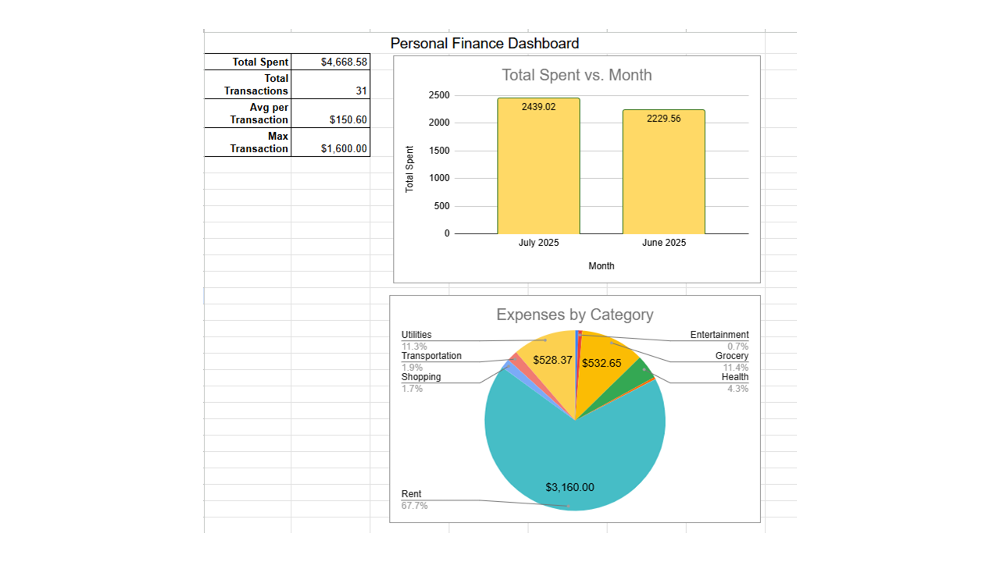

# 💰 Personal Finance Tracker (Google Sheets Dashboard)

This project is a personal finance dashboard built in **Google Sheets** to track and analyze monthly expenses.  
It includes structured tables, summary calculations, pivot tables, and a clean dashboard with visuals.

---

## ✅ Features

### 🧾 Track expenses with columns:
- Date  
- Item  
- Category  
- Amount  
- Payment Method  
- Notes  

### 🧮 Automatic calculations:
- Total spent  
- Average per transaction  
- Max transaction  
- Number of transactions  

### 📊 Visualizations:
- Bar Chart → Monthly Spending  
- Pie Chart → Spending by Category  

### 🗂 Organized Layout:
- `Expenses` – main table  
- `Pivot_Category` – spending by category  
- `Pivot_Month` – spending by month  
- `Dashboard` – final visual report  

---

## 🛠 Tools Used

- **Google Sheets**  
- Pivot Tables  
- Data Validation  
- Conditional Formatting  
- `QUERY` and `ARRAYFORMULA` functions  
- Custom dashboard layout  

---

## 🧠 What I Learned

- Structuring financial data for analysis  
- Using `SUMIFS`, `COUNTIF`, `AVERAGE`, and `QUERY` in practice  
- Building clear, visual dashboards  
- Troubleshooting data types and pivot limitations in Google Sheets  

---

## 🖼️ Dashboard Preview

🔗 [Open Google Sheets Project](https://docs.google.com/spreadsheets/d/1R82V0kMJCjs_ERFgoP1__PWRP3no9dexn2kezRonw3I/edit?gid=1471058655#gid=1471058655)

---

## 🚀 Future Improvements

- Add monthly budget goals  
- Create charts for payment methods  
- Connect to Google Forms for quick data entry  
- Automate reports using App Script  

---

